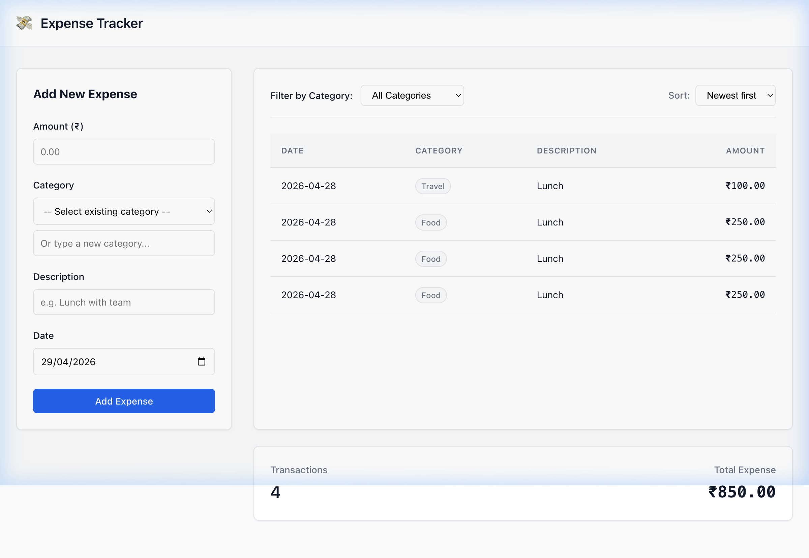

# 💸 Fenmo — Expense Tracker

A production-quality, full-stack Expense Tracker built as a timed internship assessment. Demonstrates clean architecture, API design with idempotency, integer-based financial accuracy, and a responsive React frontend — all without heavy frameworks or over-engineering.

### 🔗 Live Demo

| | URL |
|---|---|
| **Frontend** | [fenmo-expense-frontend.onrender.com](https://fenmo-expense-frontend.onrender.com/) |
| **Backend API Docs** | [fenmo-expense-tracker-qd2j.onrender.com/api-docs](https://fenmo-expense-tracker-qd2j.onrender.com/api-docs) |

> **Note:** Render free-tier services spin down after inactivity. The first request may take ~30 seconds to wake up.



---

## Features

| Feature | Detail |
|---|---|
| **Add Expenses** | Amount (₹), category, description, date — with full server-side validation |
| **Category Management** | Select from previously used categories or type a new one |
| **Filtering** | Filter expense list by category |
| **Sorting** | Newest first / Oldest first toggle |
| **Summary Totals** | Live transaction count and total amount for the current view |
| **Date Validation** | Future dates are blocked at both UI and database levels |
| **Idempotent Writes** | `Idempotency-Key` header + SHA-256 request hashing prevents duplicate expenses on network retries |
| **Financial Accuracy** | All amounts stored as integer minor units (paise) to avoid floating-point errors |
| **Responsive Design** | Desktop grid layout collapses to stacked cards on mobile |
| **API Documentation** | Auto-generated Swagger UI at `/api-docs` |

---

## Tech Stack

| Layer | Technology |
|---|---|
| Frontend | React 18 · Vite 5 · Vanilla CSS |
| Backend | Node.js · Express 4 · Zod validation |
| Database | SQLite via `better-sqlite3` |
| Testing | Vitest · Supertest (11 tests) |
| API Docs | Swagger / OpenAPI 3.0 |
| Deployment | Render (frontend + backend) |

---

## Project Structure

```
Fenmo/
├── backend/
│   ├── src/
│   │   ├── app.js                  # Express app, CORS, Swagger setup
│   │   ├── server.js               # Server entry point
│   │   ├── db.js                   # SQLite schema, constraints, indexes
│   │   ├── routes/expenses.js      # Route handlers with Swagger annotations
│   │   ├── services/expenseService.js  # Business logic + idempotency
│   │   ├── validators/expenseValidator.js  # Zod schemas
│   │   ├── middleware/errorHandler.js
│   │   └── utils/
│   │       ├── money.js            # Integer paise conversion
│   │       ├── hash.js             # SHA-256 request hashing
│   │       └── errors.js           # Custom error classes
│   ├── tests/
│   │   ├── expenses.test.js        # API integration tests (8 tests)
│   │   └── money.test.js           # Unit tests for money utils (3 tests)
│   └── database_artifacts/
│       ├── 01_schema.sql           # Documented DDL export
│       ├── 02_queries.sql          # Sample reporting queries
│       └── 03_seed.js              # Development seed script
│
├── frontend/
│   ├── src/
│   │   ├── App.jsx                 # State management, layout
│   │   ├── api.js                  # API client (fetch + idempotency)
│   │   ├── index.css               # Design system (CSS variables)
│   │   └── components/
│   │       ├── ExpenseForm.jsx     # Form with inline validation
│   │       ├── ExpenseTable.jsx    # Responsive table → mobile cards
│   │       ├── FilterBar.jsx       # Category + sort controls
│   │       └── SummaryCard.jsx     # Transaction count + total
│   └── .env.example                # Environment variable template
│
└── README.md
```

---

## Run Locally

### Prerequisites

- Node.js ≥ 18
- npm

### Backend

```bash
cd backend
npm install
npm start           # Starts on http://localhost:4000
```

### Frontend

```bash
cd frontend
npm install
npm run dev          # Starts on http://localhost:5173
```

Open [http://localhost:5173](http://localhost:5173) in your browser.

### Run Tests

```bash
cd backend
npm test             # Runs Vitest — 11 tests across 2 suites
```

### Seed Development Data

```bash
cd backend
node database_artifacts/03_seed.js    # Populates 20 sample expenses
```

---

## API Reference

Base URL: `http://localhost:4000`

Interactive docs: [http://localhost:4000/api-docs](http://localhost:4000/api-docs)

### `GET /expenses`

Retrieve all expenses with optional filtering and sorting.

| Parameter | Type | Description |
|---|---|---|
| `category` | query (optional) | Filter by category name (case-insensitive) |
| `sort` | query (optional) | `date_desc` for newest first |

**Response** `200 OK`

```json
{
  "expenses": [
    {
      "id": "exp_a1b2c3...",
      "amount": "250.00",
      "amount_minor": 25000,
      "currency": "INR",
      "category": "Food",
      "description": "Lunch with team",
      "date": "2026-04-28",
      "created_at": "2026-04-28T10:30:00.000Z"
    }
  ],
  "total_amount_minor": 25000,
  "total": "250.00",
  "currency": "INR"
}
```

### `POST /expenses`

Create a new expense. Supports idempotent retries via the `Idempotency-Key` header.

**Headers**

| Header | Required | Description |
|---|---|---|
| `Content-Type` | Yes | `application/json` |
| `Idempotency-Key` | Yes | UUID v4 — prevents duplicate writes on retries |

**Request Body**

```json
{
  "amount": "250.00",
  "category": "Food",
  "description": "Lunch with team",
  "date": "2026-04-28"
}
```

**Response** `201 Created` — returns the created expense object.

**Error** `400 Bad Request` — returns field-level validation errors:

```json
{
  "error": {
    "code": "VALIDATION_ERROR",
    "message": "Invalid expense data",
    "fields": { "amount": "Amount must be greater than 0" }
  }
}
```

---

## Design Decisions

| Decision | Reasoning |
|---|---|
| **Integer money (paise)** | `250.00` is stored as `25000` to avoid IEEE 754 floating-point errors that plague financial software |
| **Idempotency via hashing** | SHA-256 of the request body is compared against stored hashes — detects duplicate submissions vs. genuinely different requests using the same key |
| **SQLite CHECK constraints** | `amount_minor > 0`, `length(date) = 10`, `currency = 'INR'` — database enforces invariants even if application validation is bypassed |
| **No ORM** | Raw `better-sqlite3` keeps the data layer transparent, fast, and easy to audit |
| **Frontend state in App.jsx** | A single centralized state container avoids premature abstraction — clean and debuggable |
| **`crypto.randomUUID()`** | Uses the browser's native API instead of importing a UUID library on the frontend |
| **CSS-only responsive table** | Table rows collapse into labeled cards on mobile using `data-label` attributes — no JS layout library needed |

---

## Environment Variables

### Backend (`backend/.env`)

| Variable | Default | Description |
|---|---|---|
| `PORT` | `4000` | Server port |
| `DATABASE_URL` | `./data/expenses.db` | SQLite file path |
| `CORS_ORIGIN` | `http://localhost:5173` | Allowed frontend origin |

### Frontend (`frontend/.env`)

| Variable | Default | Description |
|---|---|---|
| `VITE_API_URL` | `http://localhost:4000` | Backend API base URL |

---

## Known Limitations

| Limitation | Context |
|---|---|
| **Ephemeral storage on Render** | Render's free tier uses an ephemeral filesystem — the SQLite database resets on each redeploy or service restart. This is acceptable for an assessment demo. A production deployment would use a persistent volume or switch to PostgreSQL. |
| **No authentication** | The PRD specifies a single-user MVP. Auth is intentionally excluded to keep scope focused. |
| **No edit / delete** | By design per the PRD — the MVP is append-only. |

---

## Author

**Kiran Reddy**

- GitHub: [kiranreddy29](https://github.com/kiranreddy29)
- LinkedIn: [kiran-reddy-351116287](https://linkedin.com/in/kiran-reddy-351116287)
